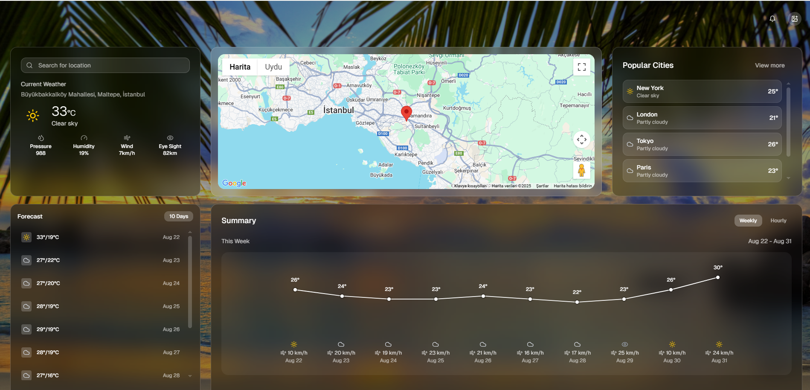

# Weather Dashboard

A modern, responsive weather dashboard built with **Next.js + React + Tailwind CSS**.  
It fetches forecasts from **Open-Meteo** and displays your location on **Google Maps**.  
Includes a **background picker** (presets + custom uploads saved to `localStorage`), **search**, and a **10-day forecast** with a clean line graph.

---

##  Live Demo

**https://weather-dashboard-lyart.vercel.app/**

---

## 📸 Screenshot

> Replace the path if your image lives somewhere else.



---

## ✨ Features

- Search **any location** and view the forecast
- **10-day forecast** and **hourly** view
- **Interactive map** (Google Maps)
- **Background themes**
  - Choose from preset images
  - Upload your own (persisted via `localStorage`)
- Temperature, wind, humidity, pressure, and visibility summaries
- Fully **responsive** UI

---

## 🧰 Tech Stack

- **Framework:** Next.js (React)
- **Styling:** Tailwind CSS
- **Maps:** `@vis.gl/react-google-maps` (+ Google Maps JS API)
- **Weather:** Open-Meteo (no API key required)
- **Icons:** `lucide-react`

---
## 📦 Installation

1. **Clone the repository**
   ```bash
   git clone https://github.com/DenizS4/FitzoneGymApp.git
   cd FitzoneGymApp

2. **Install dependencies**
   ```bash
   npm install
   
3. **Run the project**
   ```bash
   npm run dev

4. **Open the project**
   ```bash
   http://localhost:3000


